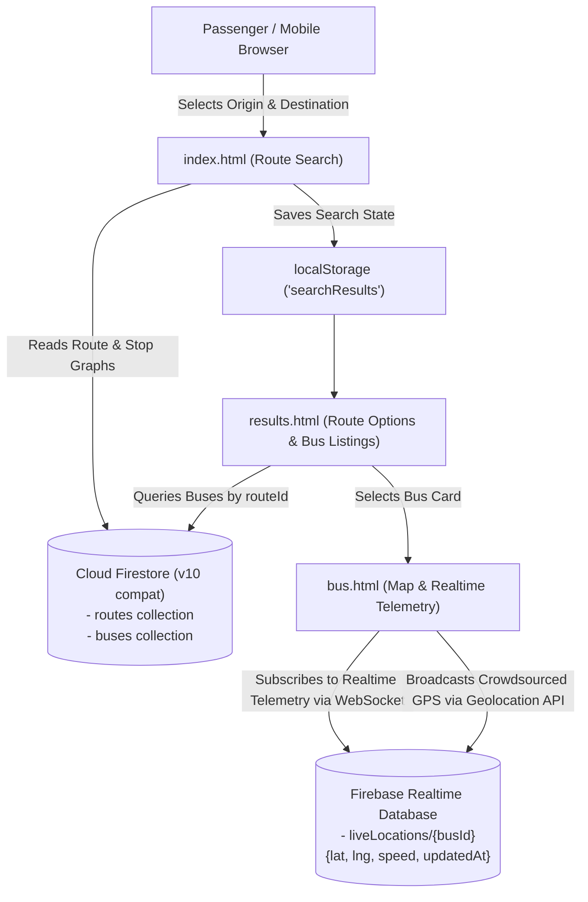

# TRAVEL MATE 🚌 — Smart Public Transport Route Discovery & Real-Time Tracking

**TRAVEL MATE** is a modern, responsive web application engineered to solve public transit discovery and bus tracking. It combines graph-based bus route discovery with live, crowdsourced GPS telemetry using Firebase Firestore, Firebase Realtime Database, and Leaflet.js.

---

## 1. System Architecture



### Component Responsibilities
* **Frontend:** HTML5, CSS3 (responsive grid & flexbox with mobile-first layout), Vanilla ES6+ JavaScript.
* **Mapping Engine:** Leaflet.js rendering OpenStreetMap tiles without full-page reloads.
* **Firebase Firestore (v10 Compat Mode):** Document database storing static transit networks, route stop arrays, schedules, and bus metadata.
* **Firebase Realtime Database (v10 Compat Mode):** Ultra-low latency WebSocket stream for live GPS coordinates (`lat`, `lng`, `speed`, `updatedAt`).
* **Crowdsourced GPS:** Passenger broadcast mode leveraging `navigator.geolocation.watchPosition()`.

---

## 2. Core Engineering Principles & Algorithms

### A. Graph-Based Route Discovery (`script.js`)
1. **Direct Routes:**
   A route satisfies a direct trip if both `from` and `to` are present in its `stops` array, enforcing strict traversal order:
   $$\text{index}(from) < \text{index}(to)$$

2. **1-Transfer Multi-Leg Connection:**
   When no direct bus exists, the engine discovers a connecting vertex $T$ (`transferPoint`) between Route $A$ and Route $B$ such that:
   $$\text{index}(from) < \text{index}(T) \quad \text{in Route } A$$
   $$\text{and}$$
   $$\text{index}(T) < \text{index}(to) \quad \text{in Route } B$$

3. **Graceful Fallback Mode:**
   If the Firestore collection is empty, offline, or slow to respond (>3.5s), a built-in Kerala transit network automatically activates so users and evaluators never encounter a broken state.

### B. Haversine Great-Circle Distance & ETA Formula (`bus.js`)
On a spherical Earth of mean radius $R = 6371\text{ km}$, straight-line Euclidean distance fails due to Earth's curvature. The **Haversine Formula** calculates the shortest distance over the Earth's surface:

$$\Delta\phi = \frac{(\text{lat}_2 - \text{lat}_1)\pi}{180}, \quad \Delta\lambda = \frac{(\text{lon}_2 - \text{lon}_1)\pi}{180}$$

$$a = \sin^2\left(\frac{\Delta\phi}{2}\right) + \cos\left(\frac{\text{lat}_1 \pi}{180}\right) \cos\left(\frac{\text{lat}_2 \pi}{180}\right) \sin^2\left(\frac{\Delta\lambda}{2}\right)$$

$$c = 2 \cdot \text{atan2}\left(\sqrt{a}, \sqrt{1-a}\right)$$

$$d = R \cdot c \quad (\text{km})$$

**Estimated Arrival Time (ETA):**
$$\text{ETA (mins)} = \left(\frac{d}{\text{Effective Speed (30 km/h)}}\right) \times 60$$

### C. Resource Cleanup & Memory Leak Prevention
Web applications listening to persistent WebSockets (`rtdb.ref().on()`) and hardware GPS streams (`watchPosition()`) can drain user battery and retain zombie memory. TRAVEL MATE attaches teardown handlers to `window.addEventListener('beforeunload')`:
* Detaches Realtime Database listeners via `liveLocationRef.off()`.
* Cancels hardware GPS watches via `navigator.geolocation.clearWatch(watchId)`.
* Clears periodic interval timers.

---

## 3. Database Schema

### Cloud Firestore Collections

#### 1. `routes` Collection
```json
{
  "name": "Kottayam - Kottarakara Fast Passenger",
  "stops": [
    "Kottayam",
    "Changanassery",
    "Thiruvalla",
    "Chengannur",
    "Adoor",
    "Oyur",
    "Kottarakara"
  ]
}
```

#### 2. `buses` Collection
```json
{
  "registrationNumber": "KL-05-AW-4021",
  "operator": "KSRTC",
  "busType": "Fast Passenger",
  "departureTime": "07:30 AM",
  "routeId": "<document_id_of_route>"
}
```

### Firebase Realtime Database
Path: `liveLocations/{busId}`
```json
{
  "lat": 9.5916,
  "lng": 76.5222,
  "speed": 38,
  "updatedAt": 1727300000000
}
```

---

## 4. Setup & Running Locally

1. Open the project folder in **VS Code**.
2. Update `firebase-config.js` with your Firebase project credentials if using your own Firebase project.
3. Start local development server:
   * Right-click `index.html` → **Open with Live Server**.
   * Or run Python's built-in server:
     ```bash
     python -m http.server 5500
     ```
4. Access `http://localhost:5500` in your web browser.

---

## 5. College Viva / Technical Defense Cheat Sheet

| Question | Model Answer |
| :--- | :--- |
| **Why use Firestore for routes and Realtime DB for tracking?** | Firestore is optimized for structured, indexed document querying (e.g. `where("routeId", "==", id)`). Realtime Database uses low-overhead persistent WebSockets designed for high-frequency coordinate stream writes with minimal latency and lower cost per write. |
| **Why can't we use simple Pythagoras theorem ($a^2 + b^2 = c^2$) for distance?** | Euclidean geometry assumes a flat plane. The Earth is an oblate spheroid where meridians converge at the poles. The Haversine formula accounts for spherical curvature, providing sub-kilometer precision across transit distances. |
| **How does crowdsourcing tracking work without dedicated GPS hardware?** | Any passenger or driver on board the bus opens the bus tracking page and taps "Share My Location". Their smartphone's HTML5 Geolocation API streams GPS coordinates to `liveLocations/{busId}` in Realtime Database, immediately updating the Leaflet map for all other passengers. |
| **How are transfer routes discovered without a backend graph server?** | The client queries the routes list and performs an in-memory 2-hop intersection search enforcing directional sequence: boarding stop appears before connecting stop in Route A, and connecting stop appears before destination in Route B. |
